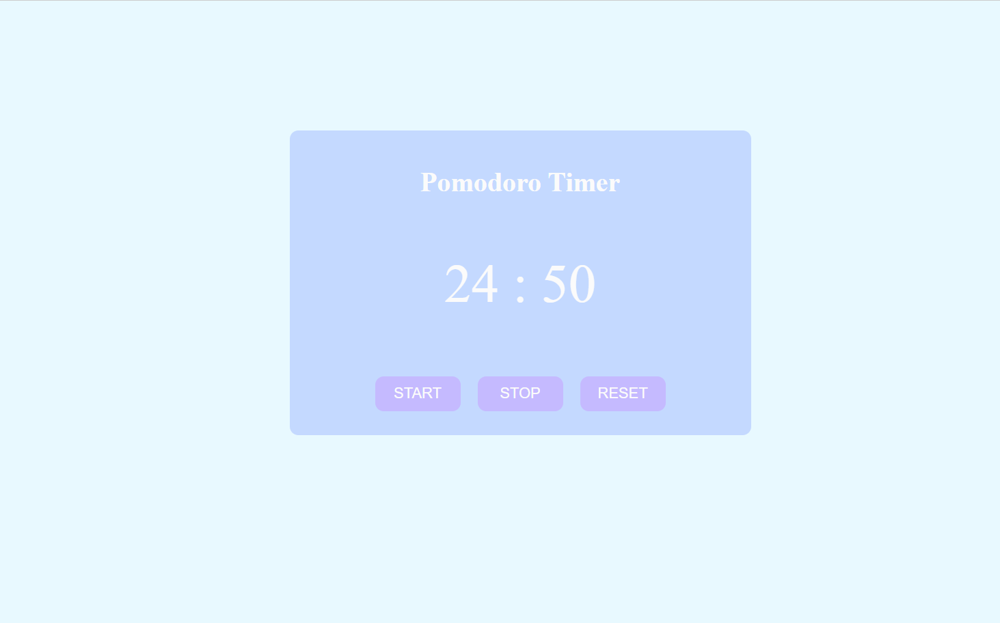

# Pomodoro Timer
A simple Pomodoro Timer with Start, Stop, and Reset buttons built using HTML, CSS, and JavaScript. The pomodoro timer  is fully responsive, ensuring a seamless experience across all screen sizes and devices.

## Technologies Used

- HTML5
- CSS3
- JavaScript

## Screenshots

